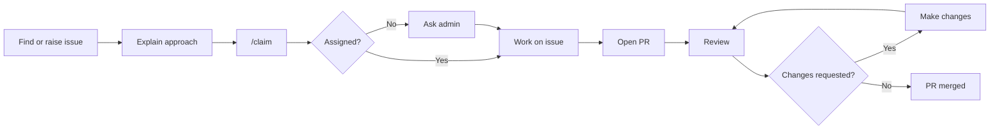

# Contributing to LearnHub

Thanks for contributing to LearnHub.

Before contributing, please read our [Code of Conduct](CODE_OF_CONDUCT.md) and follow the guidelines below.

> [!TIP]
> **First contribution?** Introduce yourself briefly and mention what you are interested in. You do not need to mention your GitHub username. This helps maintainers understand your interests when assigning issues.

## How to contribute



### Found a problem?

If you find a bug or missing feature, open an issue and explain:

* What is wrong?
* How can it be reproduced?
* What should happen?
* How you plan to fix it, if you know.

If you want to work on an existing issue, read it first and comment with your approach.

## Claiming an issue

After explaining your approach, use `/claim` in a **separate comment**.

```text
I will fix the login issue by updating the token validation and testing expired sessions.

/claim
```

Keep `/claim` in its own comment so the automation can detect it.

> [!NOTE]
> If `/claim` does not work because the automation or GitHub token is unavailable, do not keep retrying. Leave your approach in the issue and an admin can assign it manually.

If `/claim` works, wait for the issue to be assigned before starting.

To release your assignment:

```text
/unassign
```

If the automation does not work, an admin may remove the assignment manually.

## Assignment and timelines

| Issue        | PR timeline |
| ------------ | ----------: |
| Normal issue |  **4 days** |
| Larger issue |  **6 days** |

The timeline starts after the issue is assigned.

After opening a PR, **1 day is available for review and requested changes**.

> [!TIP]
> If you are blocked or need more time, update the issue before the deadline. If there is no meaningful progress, the issue may be unassigned and given to another contributor.

## Branch naming

Use a clear branch name:

| Type          | Example                     |
| ------------- | --------------------------- |
| Feature       | `feat/user-profile`         |
| Bug fix       | `fix/login-error`           |
| Documentation | `docs/contributing-guide`   |
| Refactor      | `refactor/auth-service`     |
| Tests         | `test/login-flow`           |
| Chore         | `chore/update-dependencies` |

## Commits

Use clear commit messages following this format:

```text
<type>(<scope>): <description>
```

Examples:

```text
feat(auth): add token validation
fix(login): handle expired sessions
docs: update setup instructions
test(auth): add token tests
```

Keep commits focused and avoid messages like:

```text
update
changes
final
final-final
```

## Pull requests

Before opening a PR:

* Link the related issue.
* Explain what you changed.
* Test your changes locally.
* Fix lint and build errors.
* Remove debug code and unnecessary files.
* Keep the PR focused on the assigned issue.

> [!NOTE]
> If your PR needs changes after review, make the requested changes and update the same PR. You do not need to open another PR.

## Code quality

Please keep contributions clean and easy to review.

* Follow the existing project structure.
* Follow the project's linting and formatting rules.
* Do not commit secrets, tokens, passwords, or `.env` files.
* Avoid unnecessary dependencies.
* Remove debug code and unused imports.
* Add or update tests when needed.

## Useful Git commands

### Sync with `main`

```bash
git fetch upstream
git rebase upstream/main
```

### Fix merge conflicts

```bash
git status
```

Fix the conflicted files, then:

```bash
git add .
git rebase --continue
```

To cancel the rebase:

```bash
git rebase --abort
```

### Update your PR

```bash
git add .
git commit -m "fix: resolve review feedback"
git push
```

After a rebase:

```bash
git push --force-with-lease
```

> [!WARNING]
> Use `--force-with-lease` instead of `--force`. Never force-push to `main`.

## Keep contributions meaningful

Please do not:

* Open empty or meaningless PRs.
* Copy another contributor's active work.
* Create duplicate accounts to gain an advantage.
* Manipulate issues, assignments, labels, reviews, or contribution tracking.
* Add unrelated changes to an assigned issue.
* Copy code without understanding or proper attribution.
* Make changes only to increase activity, XP, or recognition.

If an issue is unclear or already being worked on, ask before starting.

## Open source programs

If LearnHub is part of an open source program and you are contributing through that program, you must follow **both**:

1. LearnHub's [Code of Conduct](CODE_OF_CONDUCT.md) and contribution guidelines.
2. The open source program's Code of Conduct, terms, conditions, and contribution rules.

> [!IMPORTANT]
> Program specific rules also apply to your participation. Following LearnHub's rules does not replace the rules of the external program.

## Quick checklist

Before opening your PR:

* [ ] I understand the issue.
* [ ] I explained my approach.
* [ ] I used `/claim` separately.
* [ ] The issue is assigned to me.
* [ ] My branch follows the naming convention.
* [ ] I tested my changes.
* [ ] I fixed lint/build errors.
* [ ] My PR is focused.
* [ ] I linked the issue.
* [ ] I followed the applicable Code of Conduct and program rules.

> [!TIP]
> If you are unsure about something, ask before starting. A short question can save you from redoing the work later.
