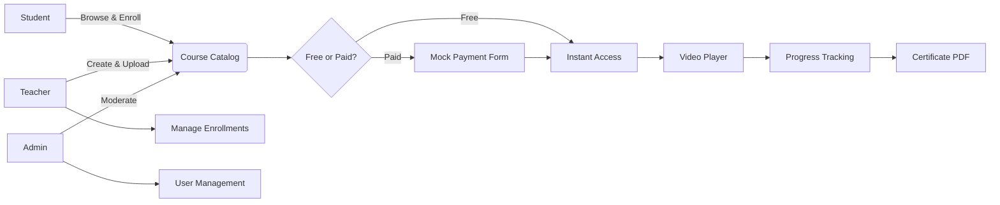
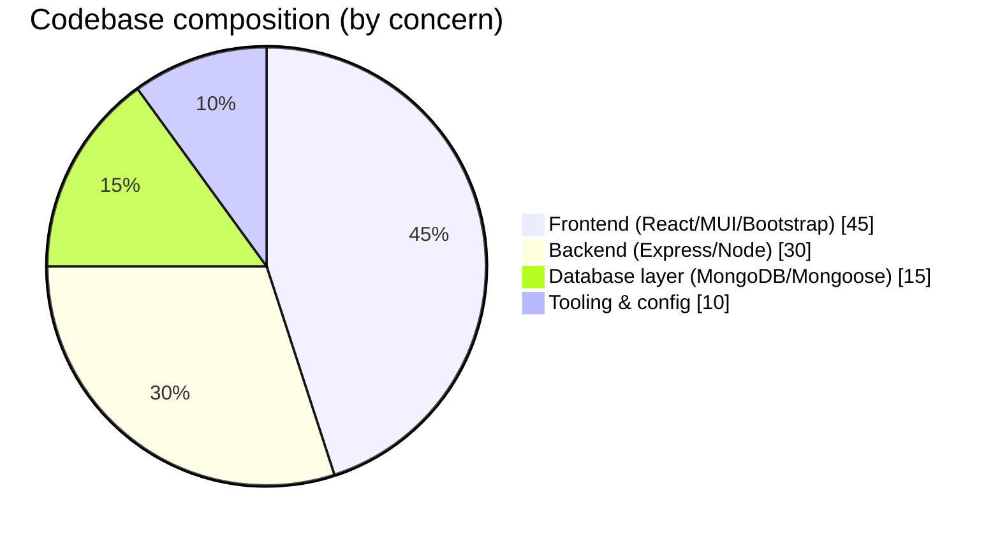
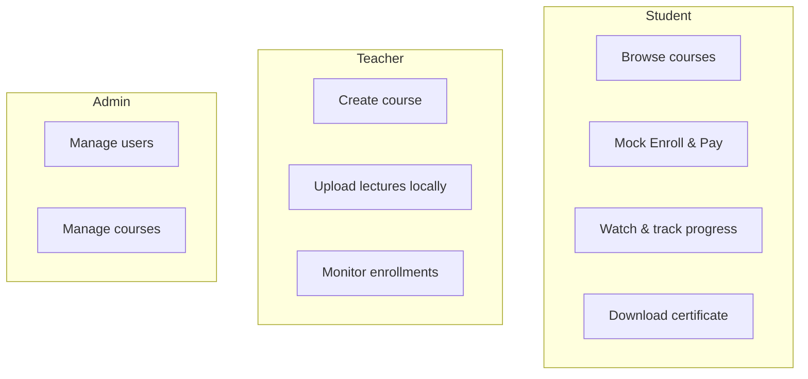

<div align="center">

<br/>

```
 _                                _   _       _     
| |                              | | | |     | |    
| |      ___  __ _ _ __ _ __     | |_| |_   _| |__  
| |     / _ \/ _` | '__| '_ \    |  _  | | | | '_ \ 
| |____|  __/ (_| | |  | | | |   | | | | |_| | |_) |
\_____/ \___|\__,_|_|  |_| |_|   \_| |_/\__,_|_.__/ 
                                                    
```

### A full-stack e-learning platform for video-based courses

<br/>

[](https://www.mongodb.com)
[](https://expressjs.com)
[](https://react.dev)
[](https://vitejs.dev)
[](LICENSE)
[](#-deployment)

<br/>

> LearnHub is a MERN app where students enroll in video courses, teachers upload lectures, and progress gets tracked along the way.
>
> 🚧 Only runs locally right now. Haven't picked a host yet, see [Deployment](#-deployment).

<br/>

[Features](#-key-features) · [Tech Stack](#-tech-stack) · [Getting Started](#-getting-started) · [Demo Accounts](#-demo-accounts) · [Architecture](#-project-structure) · [Deployment](#-deployment) · [Open Source](#️-open-source-programs) · [License](#-license)

---

</div>

## 🌟 Overview

LearnHub is a course platform where teachers upload video lectures and students work through them at their own pace. Students enroll, watch content, mark sections complete, and download a PDF certificate once they finish a course. Teachers get their own dashboard to publish courses and check who's enrolled. Admins can view and delete registered users and courses via the React dashboard.

<br/>

## 🧭 How it fits together



<br/>

## 🛠 Tech Stack

<div align="center">

### Backend

| | Technology | Purpose |
|---|---|---|
|  | **Express.js** | Routes, middleware, and controllers |
|  | **MongoDB** | Stores users, courses, and mock payment records (login activity is recorded but not exposed in the UI) |
|  | **Node.js** | Runs the server |

### Frontend

| | Technology | Purpose |
|---|---|---|
|  | **React** | Component-based UI |
|  | **Material UI** | Tables, dashboard buttons, icons |
|  | **Bootstrap** | Grid layouts, forms, modals |

### Tooling & DevX

| | Technology | Purpose |
|---|---|---|
|  | **Vite** | Dev server and build tool |
|  | **Axios** | HTTP requests to the backend |

</div>

<br/>

### Stack breakdown



<br/>

## ✨ Key Features

<table>
<tr>
<td width="33%" valign="top">

### 👨‍🎓 Student
- Browse and search courses by title or category
- Enroll instantly in free courses, or submit mock card details for premium ones
- Stream lectures with the built-in video player
- Mark sections complete and download a certificate

</td>
<td width="33%" valign="top">

### 👩‍🏫 Teacher
- Create courses with title, category, description, and price
- Upload lecture videos as `.mp4` files (stored locally on server filesystem)
- Track enrollment numbers for your own courses
- Delete courses you created

</td>
<td width="33%" valign="top">

### 🛡️ Admin
- View and manage every registered account
- Remove any course from the platform
- View enrollment counts per course

</td>
</tr>
</table>

<br/>

## 👥 Who does what



<br/>

## 📁 Project Structure

```
learnhub/
│
├── backend/                    # Express API and database models
│   ├── config/                 # DB connection setup
│   ├── controllers/            # Controller logic
│   ├── middlewares/            # Auth and role verification middlewares
│   ├── routers/                # Express routing files
│   ├── schemas/                # Mongoose schemas
│   ├── seed.js                 # Standalone seeding script
│   ├── .env
│   └── package.json
│
└── frontend/                   # React SPA powered by Vite
    ├── src/
    │   ├── components/         # UI components (Admin/User/Common)
    │   ├── App.css
    │   ├── App.jsx
    │   └── main.jsx
    └── package.json
```

<br/>

## 🚀 Getting Started

No live demo yet, so you'll need to run this locally.

### Prerequisites

-  **Node.js 18+**
-  **MongoDB**

---

### 1. Clone & install

```bash
git clone https://github.com/udaycodespace/learnhub.git
cd learnhub

cd backend && npm install
cd ../frontend && npm install
```

### 2. Configure environment

Copy the example environment file to `.env` and fill in your own values:

```bash
cp backend/.env.example backend/.env
```

### 3. Run it

```bash
# Terminal A — Backend
cd backend
npm start
# → http://localhost:5000
```

```bash
# Terminal B — Frontend
cd frontend
npm run dev
# → http://localhost:5173
```

### 4. Seed demo data

Run the database seed script to populate roles, courses, and default test accounts:

```bash
cd backend
node seed.js
```

<br/>

## 🔑 Demo Accounts

After running the seed script, you can log in immediately using these credentials:

| Role | Email | Password |
|------|-------|----------|
| Admin | `learn@learnhub.com` | `changethispassword` |
| Teacher | `teacher@learnhub.com` | `teacherpassword` |
| Student 1 | `student1@learnhub.com` | `student1password` |
| Student 2 | `student2@learnhub.com` | `student2password` |

<br/>

## (Alternatively)Running with Docker

### Start all services

```bash
docker compose up --build
```

### Stop services

```bash
docker compose down
```

### Seed the database

```bash
docker compose exec backend node seed.js
```

Frontend: http://localhost:5173

Backend: http://localhost:5000

## 🛠 Roadmap / Not Yet Implemented

A few things exist in some form but aren't finished yet:
- **Real Payment Gateway Integration**: Right now checkout is a mock card form that enrolls the student without charging anything. Payment records (card details, status) get stored in MongoDB and are reachable through a backend API route, but no admin page in the UI reads them yet. Stripe or Razorpay integration is planned.
- **Admin Activity Log Viewer**: Every login gets logged to MongoDB in an `ActivityLog` collection, but there's no frontend component that displays it. The data's there, the screen for it isn't.
- **Cloud Video Hosting (Cloudinary)**: Videos are uploaded through Multer and saved locally in `./uploads/` on the server. Cloudinary env vars exist in the config, but the SDK itself isn't wired up yet.

<br/>

## 🪝 Custom Hooks

None yet. If you build one, add it here with a short usage example:

```ts
// const { hookExports } = useCustomHook();
```

<br/>

## 📜 Scripts

### Backend (`backend/`)

| Command | Description |
|---------|-------------|
| `npm start` | Starts the backend with nodemon |

### Frontend (`frontend/`)

| Command | Description |
|---------|-------------|
| `npm run dev` | Starts the Vite dev server |
| `npm run build` | Builds the production bundle |
| `npm run preview` | Previews the production build locally |

<br/>

## 🌐 Deployment

Not deployed yet, on purpose. I'd rather see how the project grows and what contributors actually need before locking in a hosting setup.

If you have thoughts on where this should live — Vercel, Render, Railway, self-hosted, or something else — open a discussion or an issue. That'll shape the decision more than me guessing upfront.

Want to help set up CI/CD once a direction is picked? Check [CONTRIBUTING.md](CONTRIBUTING.md).

---

<br/>

## ❄️ Open Source Program!

<table>
<tr>
  <td align="center">
    <a href="https://summerofcode.xyz/">
      
      <br />
      <sub><b>ECSoC 2026</b></sub>
    </a>
  </td>
</tr>
</table>

<br/>

## 🤔 New to Open Source programs/events!

Here are a few articles that will help you get an idea of how to start contributing to open source projects:
You can refer to the following articles on the basics of Git and Github.
- [Watch this video to get started, if you have no clue about open source](https://youtu.be/SYtPC9tHYyQ)
- [Forking a Repo](https://help.github.com/en/github/getting-started-with-github/fork-a-repo)
- [Cloning a Repo](https://help.github.com/en/desktop/contributing-to-projects/creating-a-pull-request)
- [How to create a Pull Request](https://opensource.com/article/19/7/create-pull-request-github)
- [Getting started with Git and GitHub](https://towardsdatascience.com/getting-started-with-git-and-github-6fcd0f2d4ac6)

<br/>

<h2>🧑‍💻 Project Maintainer</h2>

<p align="center">
  
  <br />
  <b>udaycodespace</b>
  <br />
  Creator & Maintainer of LearnHub
</p>

<br/>

## 🤝 Contributors

Contributors who submit PRs will be added to the table below.

<br/>

<!-- CONTRIBUTORS-START -->
<div align="center">

<table>
  <tbody>
    <tr>
      <td align="center">
        <a href="https://github.com/Jidnyasa-P">
          
          <br />
          <sub><b>Jidnyasa-P</b></sub>
          <br />
          <sub>🎨 Frontend · 💻 Code</sub>
        </a>
      </td>
      <td align="center">
        <a href="https://github.com/Aryanbuha890">
          
          <br />
          <sub><b>Aryanbuha890</b></sub>
          <br />
          <sub>🚇 Infrastructure</sub>
        </a>
      </td>
      <td align="center">
        <a href="https://github.com/Hunter69240">
          
          <br />
          <sub><b>Hunter69240</b></sub>
          <br />
          <sub>🎨 Design</sub>
        </a>
      </td>
      <td align="center">
        <a href="https://github.com/teja-311">
          
          <br />
          <sub><b>teja-311</b></sub>
          <br />
          <sub>🐛 Bug fix</sub>
        </a>
      </td>
    </tr>
  </tbody>
</table>
</div>
<!-- CONTRIBUTORS-END -->

<br/>

> 💻 Code &nbsp;·&nbsp; 🐛 Bug fix &nbsp;·&nbsp; 🧪 Tests &nbsp;·&nbsp; 🔒 Security &nbsp;·&nbsp; ⚡ Performance &nbsp;·&nbsp; 🎨 Design &nbsp;·&nbsp; 📖 Docs &nbsp;·&nbsp; 🚇 Infrastructure &nbsp;·&nbsp; ♿ Accessibility &nbsp;·&nbsp; 👀 Review

---

## 📄 License

Distributed under the **MIT License**.

See [`LICENSE`](LICENSE) for the full file.

---

<div align="center">

<br/>

**Built as a full-stack e-learning project**

*If this was useful, a ⭐ helps other people find it*

Questions, ideas, or just want to hang out? Join the [Discord](https://discord.gg/EPjNHEkMb).

<br/>

[](https://skillicons.dev)

</div>
