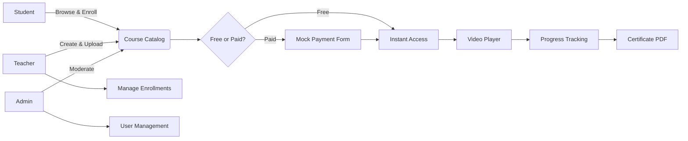

<div align="center">

<br/>

```
 _                 _   _       _
| |               | | | |     | |
| |     ___  __ _ _ __ _ __   | |_| |_   _| |__
| |    / _ \/ _` | '__| '_ \  |  _  | | | | '_ \
| |___|  __/ (_| | |  | | | | | | | | |_| | |_) |
\_____\___|\__,_|_|  |_| |_|  \_| |_/\__,_|_.__/
```

### A full-stack e-learning platform for video-based courses

<br/>

[](https://www.mongodb.com)
[](https://expressjs.com)
[](https://react.dev)
[](https://vitejs.dev)
[](LICENSE)
[](#deployment)

<br/>

> LearnHub is a MERN application where students enroll in video courses, teachers publish lectures, and progress is tracked through the learning flow.
>
> 🚧 The project is currently available for local development only. Deployment will be decided later.

<br/>

[Features](#key-features) · [Tech Stack](#tech-stack) · [Getting Started](#getting-started) · [Demo Accounts](#local-seed-accounts) · [Architecture](#project-structure) · [Deployment](#deployment) · [Open Source](#open-source-programs) · [License](#license)

---

</div>

## Overview

LearnHub is a course platform where teachers upload video lectures and students learn at their own pace. Students can enroll in courses, watch content, mark progress, and download a PDF certificate after completion.

Teachers get a dashboard to create and manage courses, while admins can view users and remove courses through the React admin interface.

## How it fits together



## Tech Stack

### Backend

| Technology | Purpose |
|---|---|
| **Express.js** | Routes, middleware, and controllers |
| **MongoDB** | Stores users, courses, and mock payment records |
| **Node.js** | Runs the server |

### Frontend

| Technology | Purpose |
|---|---|
| **React** | Component-based UI |
| **Material UI** | Tables, dashboard buttons, icons |
| **Bootstrap** | Grid layouts, forms, modals |

### Tooling & DevX

| Technology | Purpose |
|---|---|
| **Vite** | Dev server and build tool |
| **Axios** | HTTP requests to the backend |

## Key Features

### Student

- Browse and search courses by title or category.
- Enroll instantly in free courses, or submit mock card details for premium ones.
- Stream lectures with the built-in video player.
- Mark sections complete and download a certificate.

### Teacher

- Create courses with title, category, description, and price.
- Upload lecture videos as `.mp4` files stored locally on the server.
- Track enrollment numbers for created courses.
- Delete courses created by the same teacher.

### Admin

- View and manage registered accounts.
- Remove any course from the platform.
- View enrollment counts per course.

## Project Structure

```text
learnhub/
├── backend/
│   ├── config/
│   ├── controllers/
│   ├── middlewares/
│   ├── routers/
│   ├── schemas/
│   ├── seed.js
│   ├── .env
│   └── package.json
└── frontend/
    ├── src/
    │   ├── components/
    │   ├── App.css
    │   ├── App.jsx
    │   └── main.jsx
    └── package.json
```

## Getting Started

No live demo yet, so you’ll need to run this locally.

### Prerequisites

- Node.js 18+
- MongoDB local or cloud instance

### 1. Clone & install

```bash
git clone https://github.com/udaycodespace/learnhub.git
cd learnhub

cd backend && npm install
cd ../frontend && npm install
```

### 2. Configure environment

Copy the example environment file to `.env` and fill in your values:

```bash
cp backend/.env.example backend/.env
```

### 3. Run it

```bash
# Terminal A — Backend
cd backend
npm start
# → http://localhost:5000
```

```bash
# Terminal B — Frontend
cd frontend
npm run dev
# → http://localhost:5173
```

### 4. Seed demo data

Run the seed script to create local users, courses, and sample records:

```bash
cd backend
node seed.js
```

## Local Seed Accounts

After running the seed script, you can log in with these local-only development accounts:

| Role | Email | Password |
|------|-------|----------|
| Admin | `learn@learnhub.com` | `changethispassword` |
| Teacher | `teacher@learnhub.com` | `teacherpassword` |
| Student 1 | `student1@learnhub.com` | `student1password` |
| Student 2 | `student2@learnhub.com` | `student2password` |

<br/>

## (Alternatively)Running with Docker

### Start all services

```bash
docker compose up --build
```

### Stop services

```bash
docker compose down
```

### Seed the database

```bash
docker compose exec backend node seed.js
```

Frontend: http://localhost:5173

Backend: http://localhost:5000

## 🛠 Roadmap / Not Yet Implemented

## Roadmap / Not Yet Implemented

A few things exist in some form but are not finished yet:

- **Real Payment Gateway Integration**: checkout is currently a mock card form. Payment records are stored in MongoDB, but there is no live gateway integration yet.
- **Admin Activity Log Viewer**: login activity is stored in MongoDB, but the frontend screen for it is still pending.
- **Cloud Video Hosting (Cloudinary)**: videos are uploaded locally for now. Cloudinary support is planned later.

## Scripts

### Backend (`backend/`)

| Command | Description |
|---------|-------------|
| `npm start` | Starts the backend with nodemon |

### Frontend (`frontend/`)

| Command | Description |
|---------|-------------|
| `npm run dev` | Starts the Vite dev server |
| `npm run build` | Builds the production bundle |
| `npm run preview` | Previews the production build locally |

## Deployment

Deployment is not configured yet on purpose.

The plan is to decide the hosting setup after the project direction becomes clearer. If you want to suggest a platform — Vercel, Render, Railway, or self-hosted — open a discussion or issue.

If you want to help set up CI/CD once the direction is chosen, check `CONTRIBUTING.md`.

## Open Source Programs

<table>
<tr>
  <td align="center">
    <a href="https://summerofcode.xyz/">
      
      <br />
      <sub><b>ECSoC 2026</b></sub>
    </a>
  </td>
</tr>
</table>

## New to Open Source?

If you are new to Git and GitHub, these resources may help:

- [Watch this video to get started](https://youtu.be/SYtPC9tHYyQ)
- [Forking a Repo](https://help.github.com/en/github/getting-started-with-github/fork-a-repo)
- [Cloning a Repo](https://help.github.com/en/desktop/contributing-to-projects/creating-a-pull-request)
- [How to create a Pull Request](https://opensource.com/article/19/7/create-pull-request-github)
- [Getting started with Git and GitHub](https://towardsdatascience.com/getting-started-with-git-and-github-6fcd0f2d4ac6)

## Project Maintainer

<p align="center">
  
  <br />
  <b>udaycodespace</b>
  <br />
  Creator & Maintainer of LearnHub
</p>

## Contributors

Contributors who submit PRs will be added below.

<!-- CONTRIBUTORS-START -->
<div align="center">

<table>
  <tbody>
    <tr>
      <td align="center">
        <a href="https://github.com/Jidnyasa-P">
          
          <br />
          <sub><b>Jidnyasa-P</b></sub>
          <br />
          <sub>🎨 Frontend · 💻 Code</sub>
        </a>
      </td>
      <td align="center">
        <a href="https://github.com/Aryanbuha890">
          
          <br />
          <sub><b>Aryanbuha890</b></sub>
          <br />
          <sub>🚇 Infrastructure</sub>
        </a>
      </td>
      <td align="center">
        <a href="https://github.com/Hunter69240">
          
          <br />
          <sub><b>Hunter69240</b></sub>
          <br />
          <sub>🎨 Design</sub>
        </a>
      </td>
      <td align="center">
        <a href="https://github.com/teja-311">
          
          <br />
          <sub><b>teja-311</b></sub>
          <br />
          <sub>🐛 Bug fix</sub>
        </a>
      </td>
    </tr>
  </tbody>
</table>
</div>
<!-- CONTRIBUTORS-END -->

> 💻 Code · 🐛 Bug fix · 🧪 Tests · 🔒 Security · ⚡ Performance · 🎨 Design · 📖 Docs · 🚇 Infrastructure · ♿ Accessibility · 👀 Review

## License

Distributed under the **MIT License**. See [`LICENSE`](LICENSE) for the full text.

<div align="center">

**Built as a full-stack e-learning project**

*If this was useful, a ⭐ helps other people find it*

Need help? See [SUPPORT.md](SUPPORT.md) or join our [Discord](https://discord.gg/22tFSJRG2).

[](https://skillicons.dev)

</div>