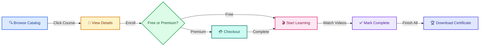
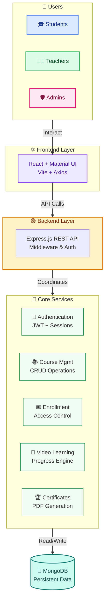
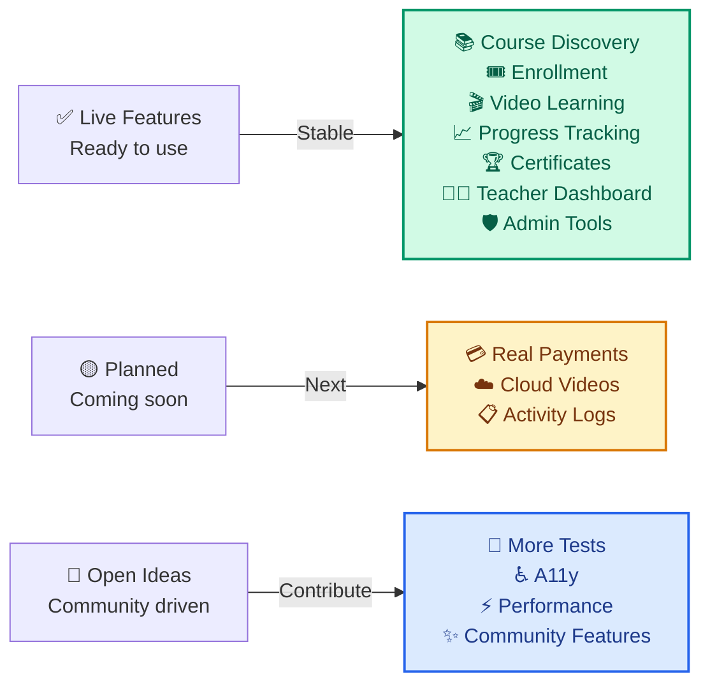
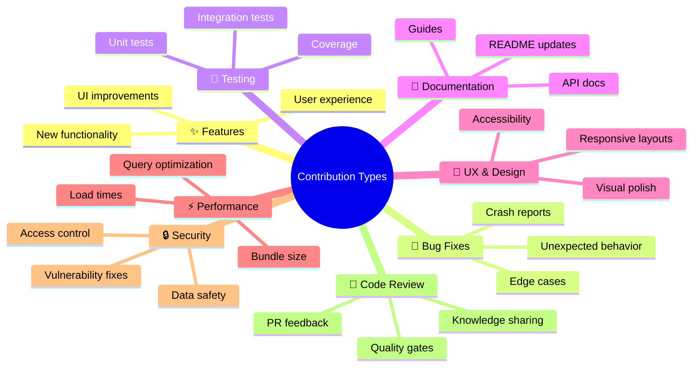
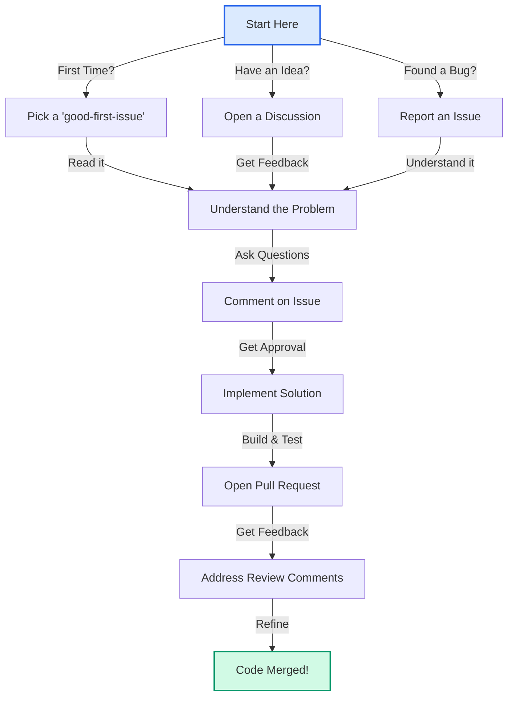
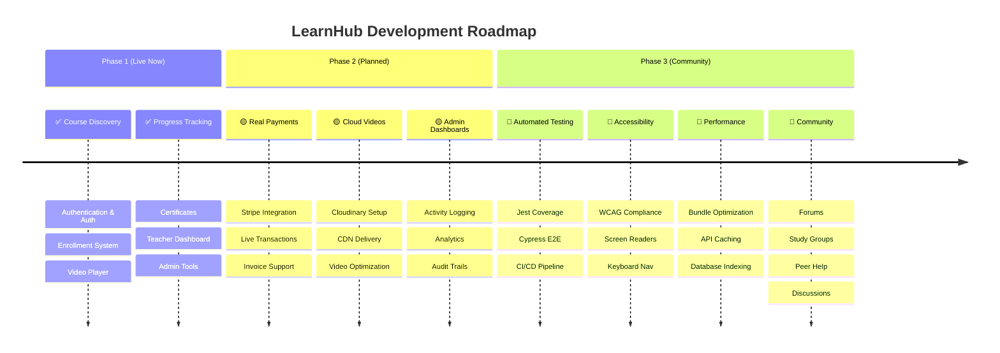
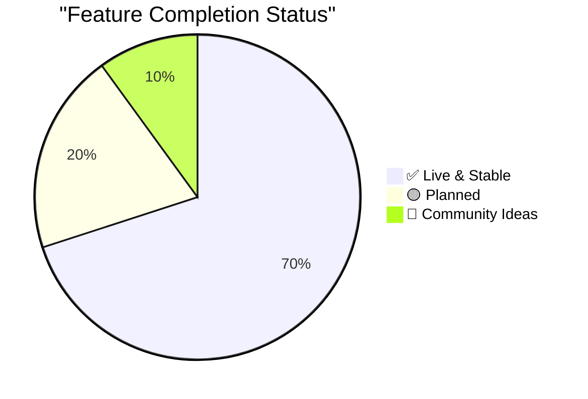
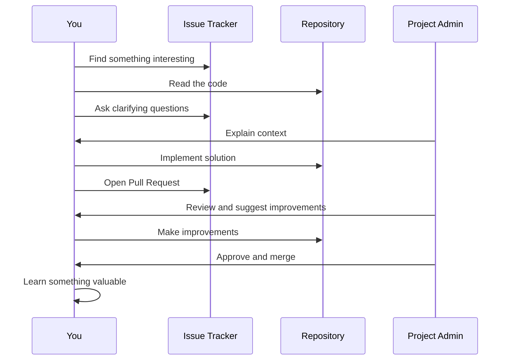
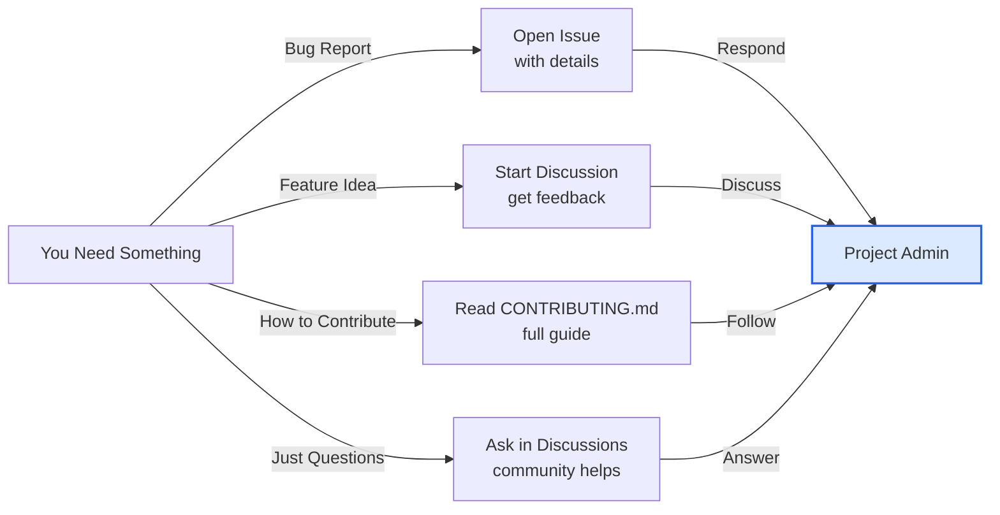

<div align="center">

# 🎓 LearnHub

### Learn something. Build something. Leave something better.

An open-source e-learning platform built by developers, for developers.

<br/>

[](https://github.com/udaycodespace/learnhub/stargazers)
[](https://github.com/udaycodespace/learnhub/network/members)
[](https://github.com/udaycodespace/learnhub/graphs/contributors)
[](LICENSE)

<br/>

[](https://www.mongodb.com)
[](https://expressjs.com)
[](https://react.dev)
[](https://nodejs.org)
[](https://vitejs.dev)
[](https://www.docker.com)

<br/>

[](https://summerofcode.xyz/)
[]()
[]()

</div>

<br/>

## 📚 Quick Navigation

[Why LearnHub?](#why-learnhub) • [How It Works](#how-it-works) • [Get Started](#get-started) • [Docker](#docker-setup) • [Contribute](#contribute) • [Roadmap](#roadmap) • [Help](#need-help)

<br/>

## 🎯 Why LearnHub?

You know that moment when you're building an e-learning platform and realize it's actually 20 different problems bolted together?

Authentication. Course management. Enrollment flows. Video delivery. Progress tracking. Certificates. Admin dashboards.

Most projects pick one or two and call it done. LearnHub does all of it. Together. In production.

That's why we built it. It's a real MERN stack you can actually understand, deploy, and extend. Not a toy example. Not a "how to build" tutorial. An actual platform people use.

For students, teachers, developers, and contributors. Real use cases. Real problems. Real solutions.

<br/>

## Part of Open Source Programs 💡

<div align="center">

<a href="https://www.summerofcode.xyz/">
  
</a>

### ECSoC '26

**Duration:** July 1, 2026 – August 31, 2026

</div>

## ⚙️ How It Works

### The Student Journey


```mermaid
flowchart LR
    A["🔍 Browse Catalog"] -->|Click Course| B["📖 View Details"]
    B -->|Enroll| C{Free or Premium?}
    C -->|Free| D["🎬 Start Learning"]
    C -->|Premium| E["💳 Checkout"]
    E -->|Complete| D
    D -->|Watch Videos| F["✅ Mark Complete"]
    F -->|Finish All| G["🏆 Download Certificate"]
    
    style A fill:#DBEAFE,stroke:#2563EB,stroke-width:2px,color:#1E3A8A
    style B fill:#FEF3C7,stroke:#D97706,stroke-width:2px,color:#78350F
    style C fill:#DCFCE7,stroke:#16A34A,stroke-width:2px,color:#14532D
    style D fill:#FCE7F3,stroke:#DB2777,stroke-width:2px,color:#831843
    style E fill:#CCFBF1,stroke:#0F766E,stroke-width:2px,color:#134E4A
    style F fill:#EDE9FE,stroke:#7C3AED,stroke-width:2px,color:#4C1D95
    style G fill:#E0E7FF,stroke:#4F46E5,stroke-width:2px,color:#312E81
```

Simple. Linear. Everything flows.

<br/>

### The Contribution Journey


```mermaid
flowchart LR
    A["💡 Find Issue"] -->|Understand| B["🧠 Learn Code"]
    B -->|Propose| C["💬 Discuss Approach"]
    C -->|Build| D["🔨 Implement"]
    D -->|Verify| E["🧪 Test Changes"]
    E -->|Submit| F["📤 Open PR"]
    F -->|Feedback| G["👀 Code Review"]
    G -->|Improve| H["✨ Merge"]
    
    style A fill:#DBEAFE,stroke:#2563EB,stroke-width:2px,color:#1E3A8A
    style B fill:#FEF3C7,stroke:#D97706,stroke-width:2px,color:#78350F
    style C fill:#DCFCE7,stroke:#16A34A,stroke-width:2px,color:#14532D
    style D fill:#FCE7F3,stroke:#DB2777,stroke-width:2px,color:#831843
    style E fill:#CCFBF1,stroke:#0F766E,stroke-width:2px,color:#134E4A
    style F fill:#EDE9FE,stroke:#7C3AED,stroke-width:2px,color:#4C1D95
    style G fill:#E0E7FF,stroke:#4F46E5,stroke-width:2px,color:#312E81
    style H fill:#D1FAE5,stroke:#059669,stroke-width:2px,color:#065F46
```

Everyone learns. Everyone grows. Everyone contributes meaningfully.

<br/>

### System Architecture


```mermaid
flowchart TB
    subgraph Users["👥 Users"]
        S["🎓 Students"]
        T["👨‍🏫 Teachers"]
        A["🛡️ Admins"]
    end
    
    subgraph Frontend["⚛️ Frontend Layer"]
        UI["React + Material UI<br/>Vite + Axios"]
    end
    
    subgraph Backend["🟢 Backend Layer"]
        API["Express.js REST API<br/>Middleware & Auth"]
    end
    
    subgraph Services["📡 Core Services"]
        Auth["🔐 Authentication<br/>JWT + Sessions"]
        Courses["📚 Course Mgmt<br/>CRUD Operations"]
        Enrollment["🎟️ Enrollment<br/>Access Control"]
        Learning["🎥 Video Learning<br/>Progress Engine"]
        Certs["🏆 Certificates<br/>PDF Generation"]
    end
    
    Database[("🍃 MongoDB<br/>Persistent Data")]
    
    Users -->|Interact| UI
    UI -->|API Calls| Backend
    Backend -->|Coordinates| Services
    Services -->|Read/Write| Database
    
    style S fill:#DBEAFE,stroke:#2563EB,stroke-width:2px,color:#1E3A8A
    style T fill:#DCFCE7,stroke:#16A34A,stroke-width:2px,color:#14532D
    style A fill:#FCE7F3,stroke:#DB2777,stroke-width:2px,color:#831843
    style UI fill:#EDE9FE,stroke:#7C3AED,stroke-width:2px,color:#4C1D95
    style Backend fill:#FEF3C7,stroke:#D97706,stroke-width:2px,color:#78350F
    style Database fill:#CCFBF1,stroke:#0F766E,stroke-width:2px,color:#134E4A
    style Auth fill:#F0FDF4,stroke:#15803D,stroke-width:1px
    style Courses fill:#F0FDF4,stroke:#15803D,stroke-width:1px
    style Enrollment fill:#F0FDF4,stroke:#15803D,stroke-width:1px
    style Learning fill:#F0FDF4,stroke:#15803D,stroke-width:1px
    style Certs fill:#F0FDF4,stroke:#15803D,stroke-width:1px
```

Clean separation. Clear responsibilities. Each layer does one thing well.

<br/>

## ✨ What You Can Actually Do

### Student Experience

| Feature | What You Do | Why It Matters |
|:---|:---|:---|
| 🔍 **Browse Catalog** | Search and filter courses by category, title, or rating | Find exactly what you want to learn |
| 🎟️ **Enroll** | Join free courses instantly or use mock checkout for premium | No barriers to starting |
| 🎬 **Watch Lectures** | Stream HD video content organized by course sections | Learn at your own pace |
| ✅ **Track Progress** | Mark lessons complete as you go, see your advancement | Know exactly where you stand |
| 🏆 **Get Certificate** | Download PDF proof of completion when done | Share your achievement |

### Teacher Experience

| Feature | What You Do | Why It Matters |
|:---|:---|:---|
| ➕ **Create Course** | Define title, description, category, and pricing tier | Build your curriculum |
| 🎥 **Upload Videos** | Add `.mp4` lecture files to each section | Teach your way |
| 📊 **Monitor Stats** | See enrollment numbers and student progress | Understand your impact |
| 💰 **Set Pricing** | Offer free or premium courses with flexible tiers | Monetize if you want |
| 🧰 **Manage Content** | Edit, update, or archive courses you created | Stay in control |

### Admin Experience

| Feature | What You Do | Why It Matters |
|:---|:---|:---|
| 👥 **View Users** | See registered students and teachers on the platform | Understand your community |
| 📚 **Manage Courses** | Review, feature, or remove courses from catalog | Maintain platform quality |
| 🗑️ **Remove Content** | Delete courses that violate policies | Keep things clean |
| 📊 **See Analytics** | Track enrollments, completions, and engagement | Measure what works |
| 🔐 **Control Access** | Manage roles and permissions across the platform | Secure and scale |

<br/>

## 🚀 Get Started in 6 Steps

### Step 1: Clone the repository

```bash
git clone https://github.com/udaycodespace/learnhub.git
cd learnhub
```

### Step 2: Install backend dependencies

```bash
cd backend
npm install
```

### Step 3: Install frontend dependencies

```bash
cd ../frontend
npm install
```

### Step 4: Configure environment

```bash
cp backend/.env.example backend/.env
```

Edit `.env` with your settings:

```env
MONGODB_URI=mongodb://localhost:27017/learnhub
PORT=5000
NODE_ENV=development
JWT_SECRET=your-secret-key-here
FRONTEND_URL=http://localhost:5173
```

### Step 5: Start backend and frontend

Backend (terminal 1):
```bash
cd backend
npm start
```
Runs at `http://localhost:5000`

Frontend (terminal 2):
```bash
cd frontend
npm run dev
```
Runs at `http://localhost:5173`

### Step 6: Seed test data

```bash
cd backend
node seed.js
```

Now you have courses and test accounts ready to explore.

<br/>

## 🔐 Test Accounts (Development Only)

Use these to explore different roles:

| Role | Email | Password | Access |
|:---|:---|:---|:---|
| 🛡️ **Admin** | `learn@learnhub.com` | `changethispassword` | Full platform control |
| 👨‍🏫 **Teacher** | `teacher@learnhub.com` | `teacherpassword` | Create and manage courses |
| 🎓 **Student** | `student1@learnhub.com` | `student1password` | Enroll and learn |
| 🎓 **Student** | `student2@learnhub.com` | `student2password` | Enroll and learn |

**Important:** Change these before any production deployment. These are for local development only.

<br/>

## 🐳 Docker Setup

Don't want to install Node? Use Docker instead.

```bash
docker compose up --build
```

That's it. Everything starts automatically:

| Service | URL | Purpose |
|:---|:---|:---|
| ⚛️ **Frontend** | `http://localhost:5173` | React application |
| 🟢 **Backend** | `http://localhost:5000` | Express API |
| 🍃 **MongoDB** | `localhost:27017` | Database (internal) |

Seed the database:
```bash
docker compose exec backend node seed.js
```

Stop everything:
```bash
docker compose down
```

<br/>

## 🧰 Available Scripts

### Backend Commands

| Command | Purpose |
|:---|:---|
| `npm start` | Start with auto-reload (development) |
| `npm run prod` | Run in production mode |
| `node seed.js` | Load test data into database |

### Frontend Commands

| Command | Purpose |
|:---|:---|
| `npm run dev` | Start Vite dev server |
| `npm run build` | Create production build |
| `npm run preview` | Test production build locally |
| `npm run lint` | Check code quality |

<br/>

## 📊 Feature Status

What's ready. What's coming. What's open to ideas.


```mermaid
graph LR
    A["✅ Live Features<br/>Ready to use"] -->|Stable| B["📚 Course Discovery<br/>🎟️ Enrollment<br/>🎬 Video Learning<br/>📈 Progress Tracking<br/>🏆 Certificates<br/>👨‍🏫 Teacher Dashboard<br/>🛡️ Admin Tools"]
    
    C["🟡 Planned<br/>Coming soon"] -->|Next| D["💳 Real Payments<br/>☁️ Cloud Videos<br/>📋 Activity Logs"]
    
    E["🔵 Open Ideas<br/>Community driven"] -->|Contribute| F["🧪 More Tests<br/>♿ A11y<br/>⚡ Performance<br/>✨ Community Features"]
    
    style B fill:#D1FAE5,stroke:#059669,stroke-width:2px,color:#065F46
    style D fill:#FEF3C7,stroke:#D97706,stroke-width:2px,color:#78350F
    style F fill:#DBEAFE,stroke:#2563EB,stroke-width:2px,color:#1E3A8A
```

<br/>

## 🌱 How to Contribute

Real talk: We don't want contributions just to pad numbers.

We want contributions that make the next person's experience better.

That's you fixing a bug. You building a feature you need. You improving docs because it was confusing. You reviewing code and asking good questions.

### What Actually Matters


```mermaid
mindmap
  root((Contribution Types))
    ✨ Features
      New functionality
      UI improvements
      User experience
    🐛 Bug Fixes
      Crash reports
      Unexpected behavior
      Edge cases
    🧪 Testing
      Unit tests
      Integration tests
      Coverage
    📖 Documentation
      README updates
      API docs
      Guides
    🎨 UX & Design
      Accessibility
      Responsive layouts
      Visual polish
    ⚡ Performance
      Query optimization
      Bundle size
      Load times
    🔒 Security
      Vulnerability fixes
      Access control
      Data safety
    👀 Code Review
      PR feedback
      Knowledge sharing
      Quality gates
```

All different. All valuable. Pick your strength.

<br/>

### Where to Start


```mermaid
flowchart TD
    A["Start Here"] -->|First Time?| B["Pick a 'good-first-issue'"]
    A -->|Have an Idea?| C["Open a Discussion"]
    A -->|Found a Bug?| D["Report an Issue"]
    
    B -->|Read it| E["Understand the Problem"]
    C -->|Get Feedback| E
    D -->|Understand it| E
    
    E -->|Ask Questions| F["Comment on Issue"]
    F -->|Get Approval| G["Implement Solution"]
    G -->|Build & Test| H["Open Pull Request"]
    H -->|Get Feedback| I["Address Review Comments"]
    I -->|Refine| J["Code Merged!"]
    
    style A fill:#DBEAFE,stroke:#2563EB,stroke-width:2px
    style J fill:#D1FAE5,stroke:#059669,stroke-width:2px
```

Simple path. No gatekeeping. Just learning.

<br/>

### Good First Issues by Type

| Type | What You'll Do | Impact | Difficulty |
|:---|:---|:---|:---|
| 🐛 **Bug Fix** | Reproduce issue, trace root cause, fix it | Improves reliability | Beginner |
| 🧪 **Add Test** | Write unit test for edge case | Prevents regressions | Beginner |
| 📖 **Doc Update** | Clarify confusing sections | Helps next developer | Easy |
| 🎨 **UI Polish** | Improve button styles, spacing, responsiveness | Better UX | Easy |
| ⚡ **Optimize Query** | Make database call faster | Snappier app | Intermediate |

Start with one. Learn as you go. Tackle bigger ones later.

<br/>

## 📁 Project Structure

```
learnhub/
├── backend/                    # 🟢 Express.js server
│   ├── config/                # Configuration
│   ├── controllers/           # Route handlers
│   ├── middlewares/           # Auth, validation
│   ├── models/                # MongoDB schemas
│   ├── routes/                # API endpoints
│   ├── seed.js                # Test data
│   ├── .env.example           # Environment template
│   └── package.json
├── frontend/                   # ⚛️ React app
│   ├── src/
│   │   ├── components/        # React components
│   │   ├── pages/             # Page routes
│   │   ├── hooks/             # Custom hooks
│   │   ├── App.jsx
│   │   └── main.jsx
│   ├── public/                # Static files
│   └── package.json
├── assets/                     # 📦 Images and media
├── docker-compose.yml         # Docker config
├── CONTRIBUTING.md            # Contribution guide
├── SUPPORT.md                 # Support docs
├── LICENSE                    # MIT License
└── README.md                  # This file
```

Backend is classic Express. Frontend is React with Vite. No surprises. Easy to follow.

<br/>

## 🗺️ Roadmap

Where we're heading. Not a promise. A direction.


```mermaid
timeline
    title LearnHub Development Roadmap
    
    section Phase 1 (Live Now)
        ✅ Course Discovery : Authentication & Auth : Enrollment System : Video Player
        ✅ Progress Tracking : Certificates : Teacher Dashboard : Admin Tools
    
    section Phase 2 (Planned)
        🟡 Real Payments : Stripe Integration : Live Transactions : Invoice Support
        🟡 Cloud Videos : Cloudinary Setup : CDN Delivery : Video Optimization
        🟡 Admin Dashboards : Activity Logging : Analytics : Audit Trails
    
    section Phase 3 (Community)
        🔵 Automated Testing : Jest Coverage : Cypress E2E : CI/CD Pipeline
        🔵 Accessibility : WCAG Compliance : Screen Readers : Keyboard Nav
        🔵 Performance : Bundle Optimization : API Caching : Database Indexing
        🔵 Community : Forums : Study Groups : Peer Help : Discussions
```

This roadmap evolves. Good ideas get prioritized. Contributor focus gets prioritized.

<br/>

## 📊 Current Feature Breakdown

What's production-ready right now:


```mermaid
pie title "Feature Completion Status"
    "✅ Live & Stable" : 70
    "🟡 Planned" : 20
    "🔵 Community Ideas" : 10
```

Most features are live. Some are planned. Some are open to great ideas from contributors.

<br/>

## 👥 Contributors

People who showed up and made this better:

<div align="center">

<table>
<tr>
<td align="center" width="20%">
<a href="https://github.com/MOHITKOURAV01">

<br/><b>MOHITKOURAV01</b>
<br/>

</a>
</td>

<td align="center" width="20%">
<a href="https://github.com/Jidnyasa-P">

<br/><b>Jidnyasa-P</b>
<br/>

</a>
</td>

<td align="center" width="20%">
<a href="https://github.com/sujalv28">

<br/><b>sujalv28</b>
<br/>

</a>
</td>

<td align="center" width="20%">
<a href="https://github.com/teja-311">

<br/><b>teja-311</b>
<br/>

</a>
</td>

<td align="center" width="20%">
<a href="https://github.com/Taniya-H">

<br/><b>Taniya-H</b>
<br/>

</a>
</td>
</tr>

<tr>
<td align="center" width="20%">
<a href="https://github.com/Aryanbuha890">

<br/><b>Aryanbuha890</b>
<br/>

</a>
</td>

<td align="center" width="20%">
<a href="https://github.com/karan-chaos">

<br/><b>karan-chaos</b>
<br/>

</a>
</td>

<td align="center" width="20%">
<a href="https://github.com/anshika-guleria">

<br/><b>anshika-guleria</b>
<br/>

</a>
</td>

<td align="center" width="20%">
<a href="https://github.com/sodium16">

<br/><b>sodium16</b>
<br/>

</a>
</td>

<td align="center" width="20%">
<a href="https://github.com/Hunter69240">

<br/><b>Hunter69240</b>
<br/>

</a>
</td>
</tr>

<tr>
<td align="center" width="20%">
<a href="https://github.com/Vachhani-Tapan">

<br/><b>Vachhani-Tapan</b>
<br/>

</a>
</td>
</tr>

</table>

</div>


Different people. Different backgrounds. Different skills. One shared project.

That's what open source is.

<br/>

## 📖 New to Open Source?

You don't need permission to contribute.

You don't need to know everything first.

You need three things:

1. **Curiosity** — Want to understand how something works
2. **Patience** — Willing to read code and ask questions  
3. **Humility** — Code review feedback isn't personal


```mermaid
sequenceDiagram
    participant You as You
    participant Issue as Issue Tracker
    participant Code as Repository
    participant Maintainer as Project Admin
    
    You->>Issue: Find something interesting
    You->>Code: Read the code
    You->>Issue: Ask clarifying questions
    Maintainer->>You: Explain context
    You->>Code: Implement solution
    You->>Issue: Open Pull Request
    Maintainer->>You: Review and suggest improvements
    You->>Code: Make improvements
    Maintainer->>You: Approve and merge
    You->>You: Learn something valuable
```

That's the workflow. Every good contributor started exactly here.

<br/>

## 💬 Need Help?


```mermaid
graph LR
    A["You Need Something"] -->|Bug Report| B["Open Issue<br/>with details"]
    A -->|Feature Idea| C["Start Discussion<br/>get feedback"]
    A -->|How to Contribute| D["Read CONTRIBUTING.md<br/>full guide"]
    A -->|Just Questions| E["Ask in Discussions<br/>community helps"]
    
    B -->|Respond| F["Project Admin"]
    C -->|Discuss| F
    D -->|Follow| F
    E -->|Answer| F
    
    style F fill:#DBEAFE,stroke:#2563EB,stroke-width:2px
```

Project admin is here to help. Ask in issues. Leave comments. We respond.

<br/>

## 🧑‍💼 Maintainer

<div align="center">

<a href="https://github.com/udaycodespace">

</a>

### SOMAPURAM UDAY

Maintains LearnHub. Supports contributors. Reviews ideas. Helps the project grow.

</div>

<br/>

## 📄 License

LearnHub is MIT licensed. Use it however you want.

You can use it for personal projects. Commercial projects. Modify it. Distribute it.

Just include the original license and copyright notice.

[](LICENSE)

See [`LICENSE`](LICENSE) for full details.

<br/>

<div align="center">

## Learn. Build. Contribute.

Built in the open. Improved together.

[](https://github.com/udaycodespace/learnhub)
[](https://github.com/udaycodespace/learnhub/fork)
[](https://github.com/udaycodespace/learnhub/issues)

Made with care. Maintained with passion. Built for people who want to learn.

</div>
